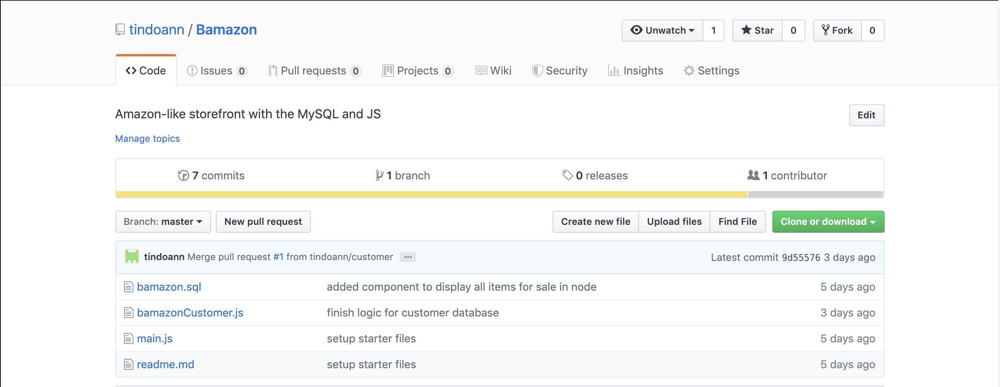
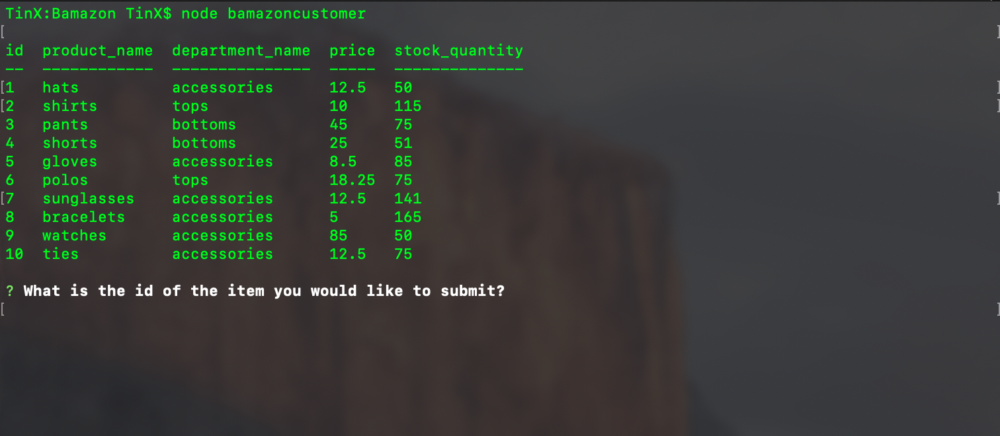
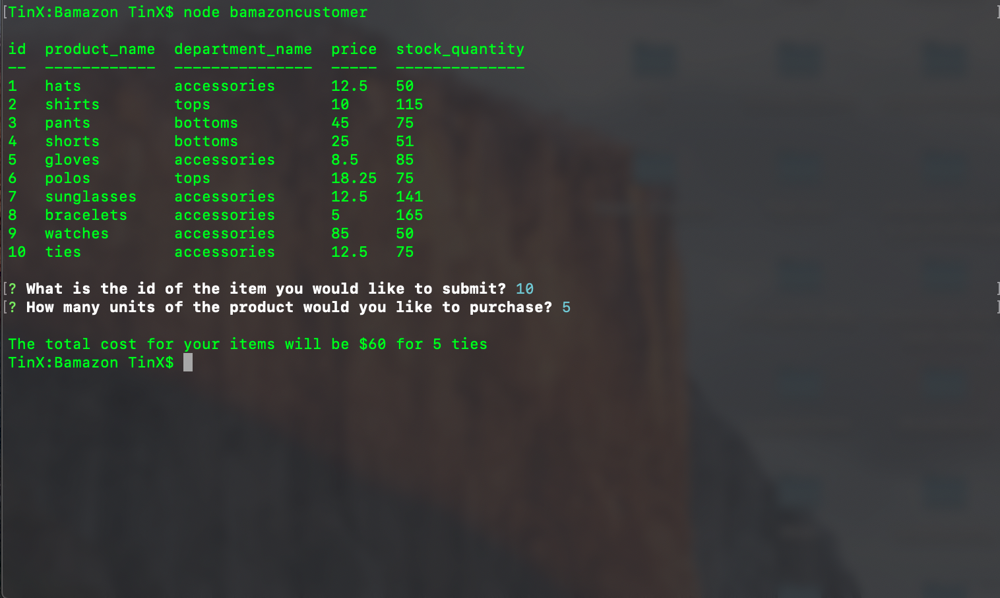
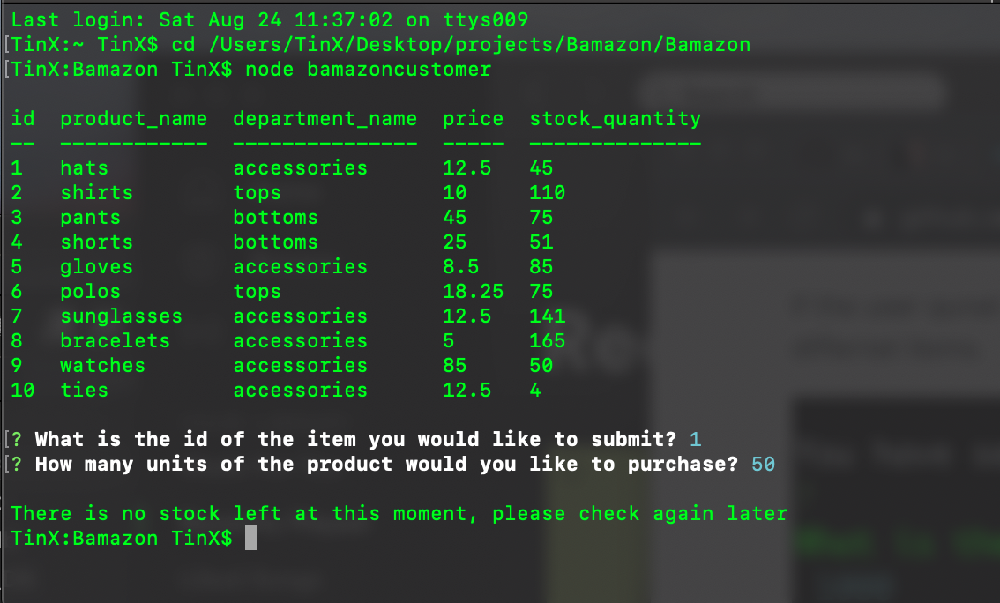
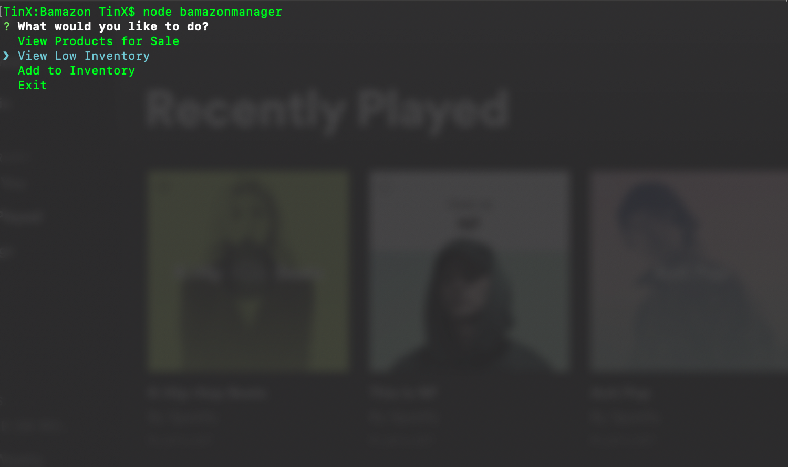
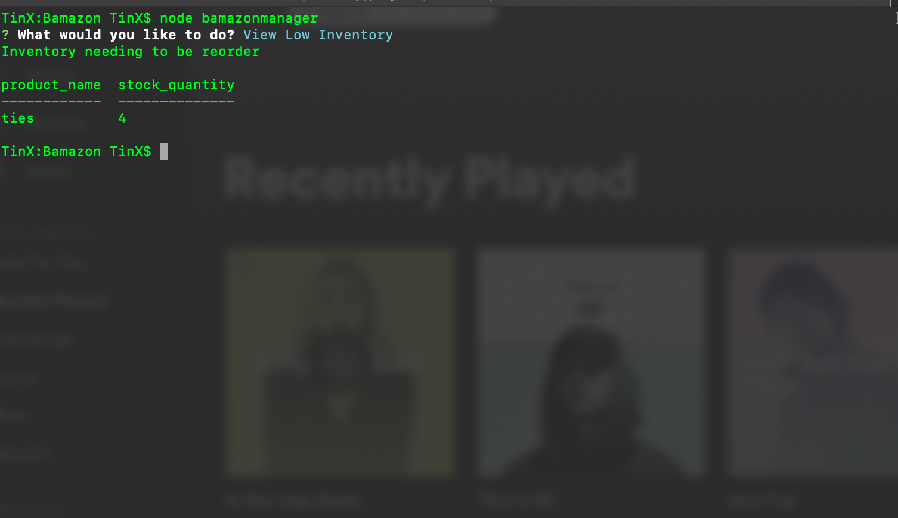
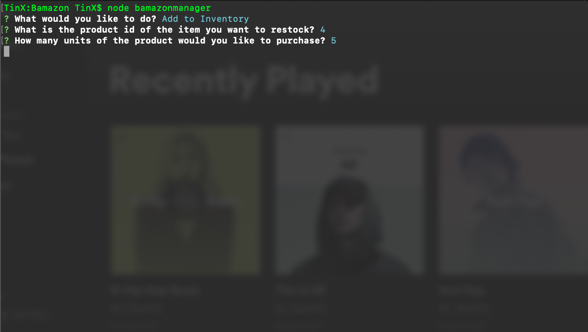

# Bamazon

Old Repo, accidently erased it with 'git reset --hard head' > 'git push origin -f'


## Overview

This app is an Amazon-like storefront with the MySQL. The app will take in orders from customers and deplete stock from the store's inventory. 

### Programs and packages used 

```
Javascript
node.js
MySQL
inquirer
console.table
```


* [Mastering Markdown](https://guides.github.com/features/mastering-markdown/)

- - -

## Walk-Through

In customer database, the user will have to log in by 'node bamazonCustomer'. The user will be greeted with a table display of the current id, product name, department name, price, and quantity. 



From here, the user will have to input the item id and quantity. After the user has placed the order, a confirmation of their order will be displayed. 



If the user requests a a greater quantity than is availabe, the user is prompted with an insuffient quantity response. 



For the manager to login into the terminal, the user will have to enter 'node bamazaonManager'. From the main menu, the terminal will then display four options: 1) View Product for sale 2) View low inventory 3) Add to inventory 4) Exit 



If the manager selects the option to view low inventory, the terminal will only display inventory with less than 5 items in stock. 



In the main menu with option 3, the manager can restock the item. 




